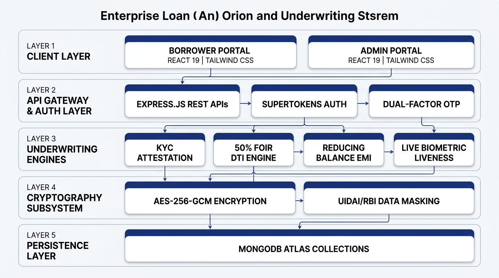
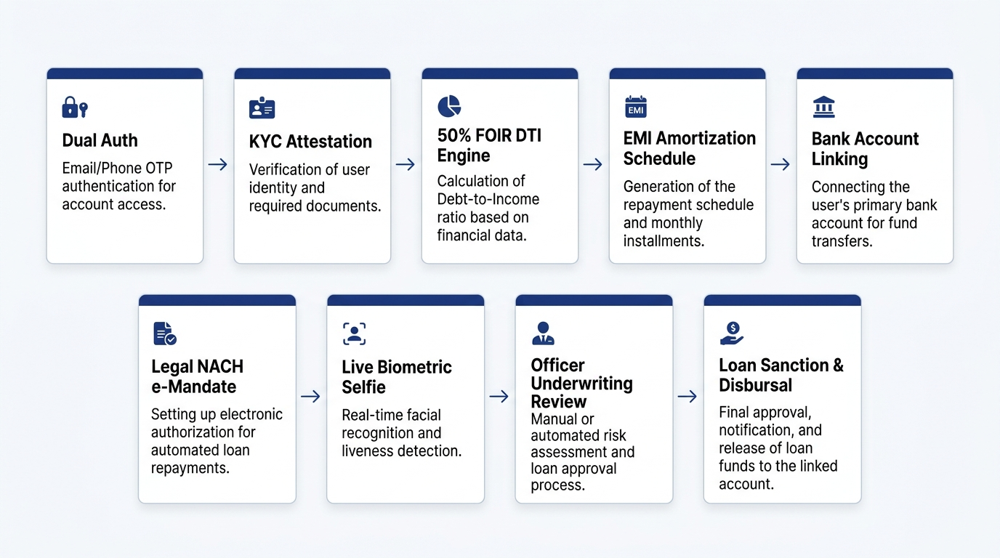
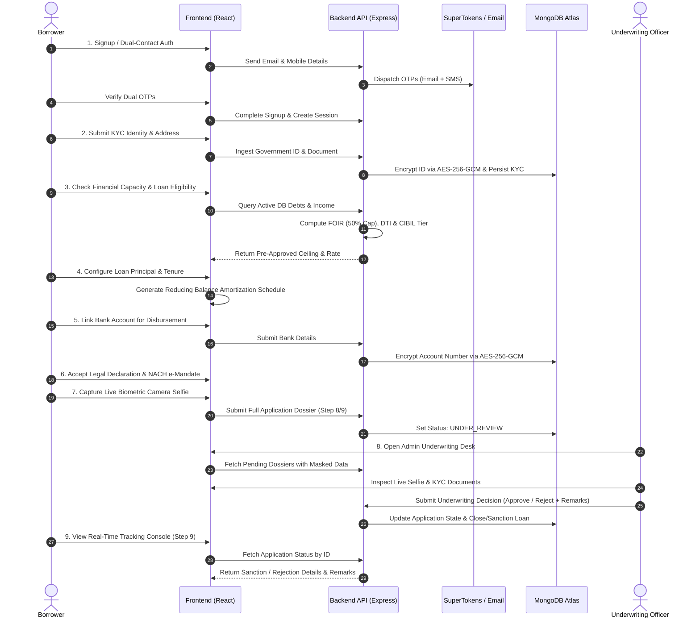
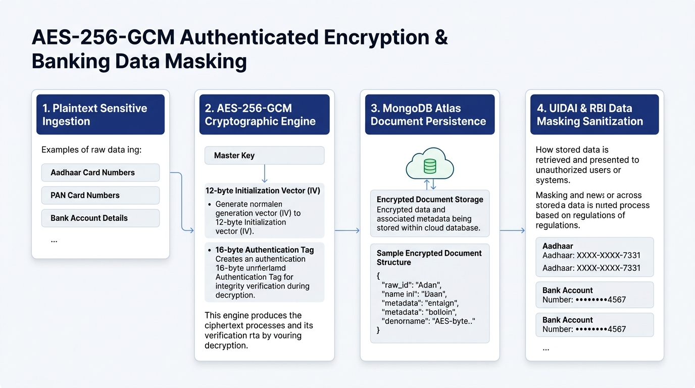
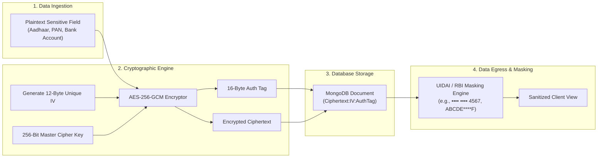
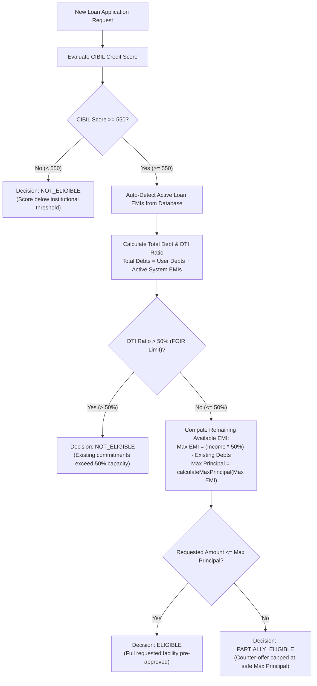

# 💳 Enterprise Digital Lending & Automated Underwriting System

An end-to-end, banking-grade **Digital Loan Origination, KYC Verification, and Automated Underwriting Platform** built with **React, Node.js/Express, MongoDB Atlas, SuperTokens, and TailwindCSS**.

The platform implements strict sequential lending gating (Dual Verification $\rightarrow$ KYC $\rightarrow$ Financial Affordability $\rightarrow$ EMI Structuring $\rightarrow$ Legal NACH Mandate $\rightarrow$ Live Biometric Selfie $\rightarrow$ Loan Officer Sanction Desk) alongside **AES-256-GCM encryption at rest** and **UIDAI/RBI banking data masking**.

---

## 🏛️ High-Level System Architecture




## 🔄 End-to-End 9-Step Lending Workflow





---

## 🔒 AES-256-GCM Cryptographic & Data Masking Pipeline





---

## 📊 Financial FOIR & Credit Decision Engine

The automated credit decisioning tree enforces institutional risk policies and the **50% FOIR (Fixed Obligation to Income Ratio)** rule:



---

## 📐 Financial Mathematical Models

### 1. Reducing-Balance EMI Equation
$$\text{EMI} = \frac{P \times r \times (1 + r)^n}{(1 + r)^n - 1}$$

Where:
* **P** = Principal Loan Amount
* **r** = Monthly Interest Rate ($\text{Annual APR} / 12 / 100$)
* **n** = Loan Tenure in Months

### 2. Maximum Principal Capacity by FOIR Cap
$$\text{Max Allowed New EMI} = \max\left(0,\; (\text{Monthly Income} \times 0.50) - \text{Total Existing Debts}\right)$$

$$\text{Max Eligible Principal} = \frac{\text{Max Allowed EMI} \times \left((1 + r)^n - 1\right)}{r \times (1 + r)^n}$$

---

## 🛠️ Technology Stack

| Layer | Technologies |
| :--- | :--- |
| **Frontend UI** | React 19, Vite, TailwindCSS v4, Lucide Icons, React Router v7 |
| **Backend API** | Node.js, Express.js (v5), SuperTokens Auth, Nodemailer, Axios |
| **Database** | MongoDB Atlas with Mongoose ODM |
| **Security** | Node `crypto` (AES-256-GCM authenticated encryption), bcryptjs |
| **Telephony / SMS** | Fast2SMS Gateway & Nodemailer Email Dual-Delivery |

---

## 🚀 Quick Start Guide

### Prerequisites
* **Node.js** v18+ and **npm**
* **MongoDB Atlas** cluster or local MongoDB instance

---

### 1. Backend Setup

1. Navigate to the server folder:
   ```bash
   cd server
   ```
2. Install dependencies:
   ```bash
   npm install
   ```
3. Configure `server/.env`:
   ```env
   PORT=5000
   MONGO_URI="your_mongodb_connection_string"
   JWT_SECRET="your_secure_jwt_secret"
   EMAIL_USER="your_email@gmail.com"
   EMAIL_PASSWORD="your_app_password"
   SUPERTOKENS_CONNECTION_URI="https://try.supertokens.io"
   FAST2SMS_API_KEY="your_fast2sms_key"
   GOOGLE_CLIENT_ID="your_google_client_id"
   GOOGLE_CLIENT_SECRET="your_google_client_secret"
   ```
4. Start the backend API:
   ```bash
   npm run dev
   ```

---

### 2. Frontend Setup

1. Navigate to the client folder:
   ```bash
   cd client
   ```
2. Install dependencies:
   ```bash
   npm install
   ```
3. Start the development server:
   ```bash
   npm run dev
   ```
4. Open [http://localhost:5173](http://localhost:5173) in your browser.

---

## 👥 Default Test Accounts & Roles

| Role | Email | Access Scope |
| :--- | :--- | :--- |
| **Customer / Borrower** | `customer@loanapp.com` | Accesses borrower dashboard, KYC form, loan calculator, and application journey |
| **Loan Officer / Admin** | `admin@loanapp.com` | Accesses credit review desk, inspects live biometrics, and sanctions/declines loans |

---

## 📜 License
This project is licensed under the **ISC License**.